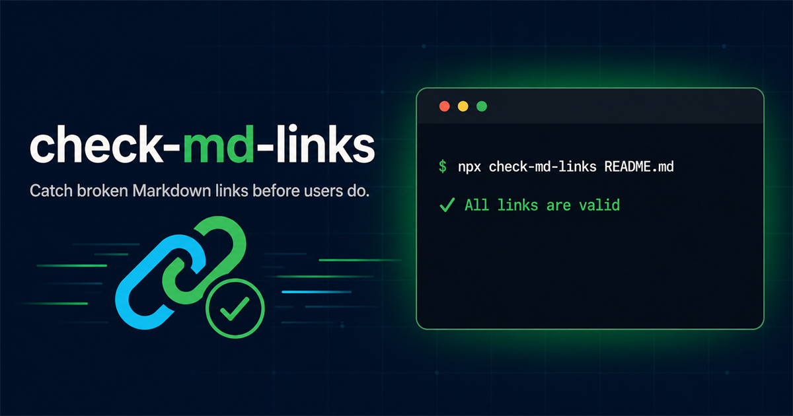

<p align="center">
  
</p>

<h1 align="center">check-md-links</h1>

<p align="center">
  <strong>A fast, zero-dependency CLI that catches broken links in Markdown files.</strong>
</p>

<p align="center">
  
  
  <a href="https://github.com/prestavera/check-md-links/actions/workflows/ci.yml"></a>
  
</p>

`check-md-links` scans a Markdown file for HTTP and HTTPS URLs, follows redirects, and reports links that fail. It uses the native Node.js `fetch` API and installs with no runtime dependencies.

## Quick start

Run it directly with `npx`:

```console
npx check-md-links README.md
```

With no file argument, `README.md` is checked by default:

```console
npx check-md-links
```

Or install it globally:

```console
npm install --global check-md-links
check-md-links docs/guide.md
```

## Why use it?

- Zero runtime dependencies
- Follows HTTP redirects
- Removes duplicate URLs before checking
- Cancels requests after 10 seconds
- Returns exit code `1` when a link is broken
- Works locally and in CI pipelines

## GitHub Actions

Add this step to a workflow:

```yaml
- name: Check Markdown links
  run: npx --yes check-md-links README.md
```

## Requirements

Node.js 18 or newer.

## License

Released under the [MIT License](LICENSE).
